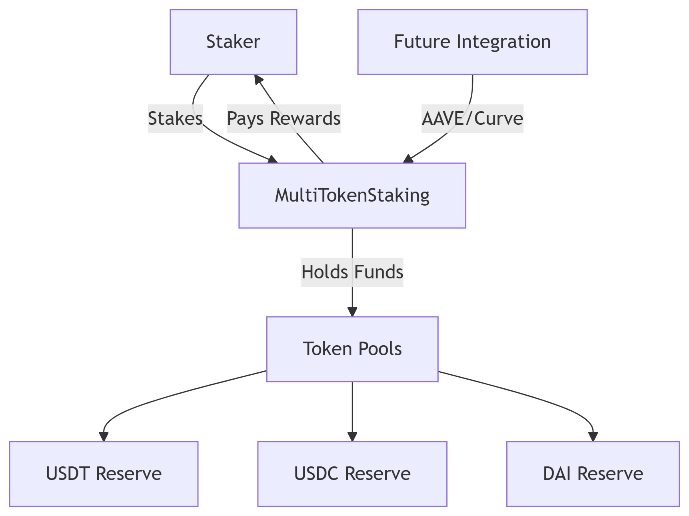

# Sample Hardhat Project
# Introduction
We have developed a Multi-Token Staking Contract that allows users to stake USDT, USDC, and DAI (Dummy tokens for first phase) and earn rewards. This document outlines the contract's features, current implementation, and future upgrades.

# Current Implementation (Phase 1)
## Multi-Token Staking : USDT, USDC, or DAI
### Each token has its own staking pool
### Tiered APY System
Tier	Min. Stake	APY	Lock Period
1	100 tokens	5%	30 days
2	1,000	8%	90 days
3	5,000	12%	180 days

### Reward Distribution
Rewards are paid from a pooled reserve (USDT + USDC + DAI)
Proportional distribution based on pool liquidity
Contract tracks stake time + tier.
Claim rewards anytime or unstake after lock period.

### Security & Upgradability
- Pausable (emergency stops)
- Reentrancy protection
- Upgradeable via proxy pattern

